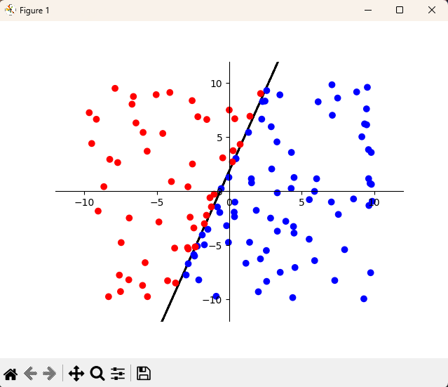

# TASK 1 - Perceptron

Cílem úkolu bylo vytvořit jednoduchý perceptron, který bude rozhodovat, zda body leží nad, pod, nebo přímo na přímce dané funkcí \( y = 3x + 2 \).

---

### **1. Inicializace perceptronu**
- Konstruktor vyžaduje pouze vstupní funkci, která je v našem případě daná zadáním.
- Následně se nastaví počáteční hodnoty vah a biasu dle prezentace.
- Rychlost učení je nastavena na 0.1

### **2. Trénink perceptronu**
- Pro trénování se vytvoří náhodná sada bodů v rozsahu daného v konstruktoru (-10, 10)
- Každý bod se dále klasifikuje podle vstupní funkce a výsledek se porovnává s očekávaným výsledkem pro následnou úpravu vah.

### **3. Testování perceptronu**
- Pro testování se vygeneruje nová sada testovacích dat, které jsou následně vykreslena na graf
- S výsledným grafem se dá iteragovat, po kliknutí je na daném místě vytvořen a následně klasifikován nový bod

- Barva bodů:
  - 🔴 _**Čerené body**_ - Perceptron označil jako ležící nad přímkou
  - 🔵 _**Modré body**_ - Perceptron označil jako ležící pod přímkou
  - 🟢 _**Zelené body**_ - Perceptron označil jako ležící na přímce

---
## Výstup
