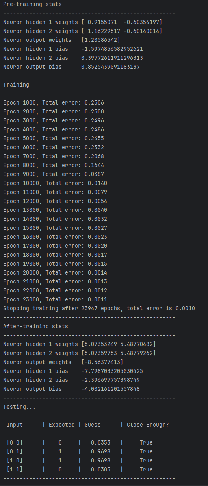

# TASK 2 - XOR problém

Cílem úkolu bylo vytvořit jednoduchou neuronovou síť, která je schopna vyhodnotit XOR operátor.

Síť obsahuje dva vstupní neurony, dva neurony ve skryté vrstvě a jeden výstupní neuron. Pro aktivaci se využívá _**sigmoidální funkce**_.

---

### 1. Inicializace sítě
- Váhy i biasy jsou nastaveny náhodnými hodnotami.
- Seed pro random je nastaven uživatelem.

### 2. Trénink sítě
- Síť se učí metodou **backpropagation**.
- **Chyba** se vypočítává jako střední kvadratická chyba mezi očekávaným a reálným výstupem.
- **Gradientní sestup** je použit k aktualizaci vah a biasů.
- Trénink pokračuje, dokud **celková chyba neklesne pod stanovenou hodnotu**.
- Každých 1000 epoch se vypisuje aktuální chyba.

### 3. Testování sítě
- Síť se testuje na datasetu, který obsahuje všechny kombinace 2 vstupních bitů.
- Výstupy se porovnávají s očekávanou hodnotou pro vizualizaci.

---
## Výstup
