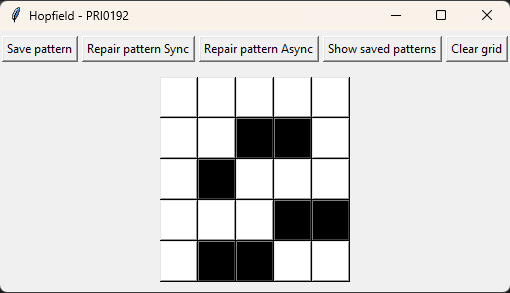
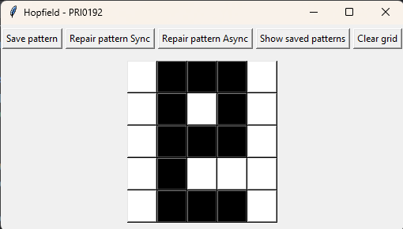
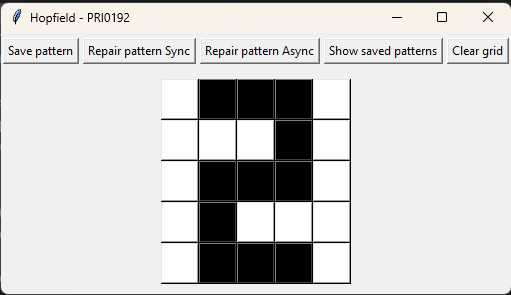
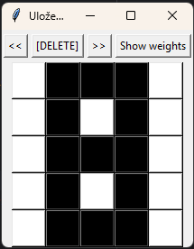
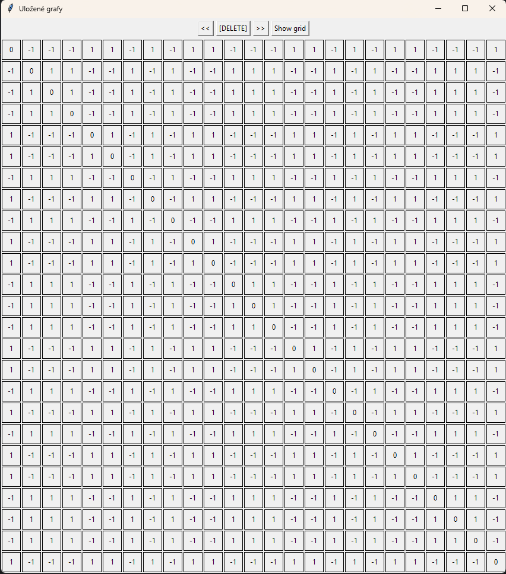

# TASK 3 - Hopfield network

Cílem úkolu bylo vytvořit Hopfieldovu síť pomocí které budeme obnovovat uložené patterny.

---

### 1. Tvorba tvarů
- Tvary/patterny se tvoří pomocí editoru klikáním na políčka.
- Po kliknutí na `Save pattern` se uloží do paměti se svoji weight maticí.
- Pomocí tlačítka `Show saved patterns` lze otevřít okno, kde lze prohlížet i spravovat uložené tvary.
  - Lze přepnout náhled na weight matici daného tvaru pomocí tlačítka `Show weights`.

### 2. Výpočet weight matice
- Vstupní matice obrazu se převede na vektor a hodnoty 0 se nahradí -1
- Weight matice se následně vypočítá jako skalární součit tohoto vektoru s transponovaným
- V posledním kroku je ještě vynulována hlavní diagonála

### 3. Oprava patternu
- Slouží k tomu dvě tlačítka `Repair pattern Sync` a `Repair pattern Async`
- Obě metody začínají tak, že se vstupní obraz převede na vektor a nahradí se hodnoty 0 hodnotou -1
- Následně se provede vektrocvý součin se součtem weight matic
- Synchronní recovery -> Násobíme celou matici vstupním vektorem
- Asynchronní recovery -> Násobíme postupně řádky weight matice a výsledek získáme pomocí sign funkce

---
## Výstup

(Před opravou)

(Sync oprava)

(Async oprava)

(Ukázka uloženého tvaru a jeho weight matice)
