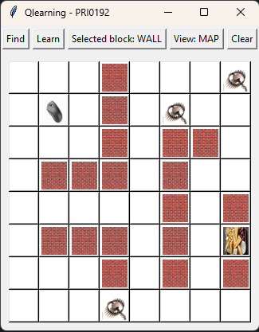
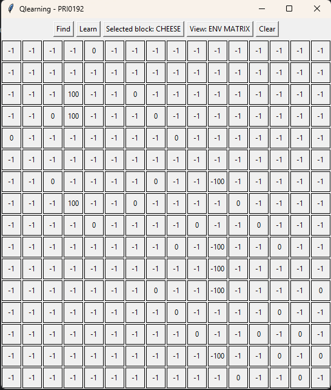
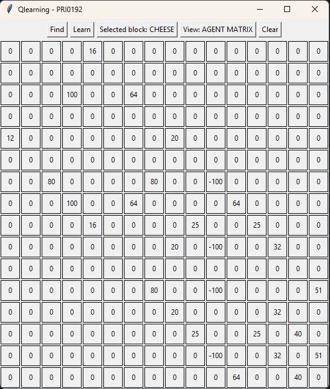

# TASK 4 - Q-learning and the game Find the cheese

Cílem bylo vytvořirt agenta (myš), který měl za pomocí reinforcement-learningu najít cestu v bludišti k cíli (sýru).

---

### 1. Vytvoření mapy
- Mapu lze vytvořit pomocí editoru.
- Uživatel může zvolit různé typy bloků (zeď, past, sýr a myš) pomocí tlačítka `Selected block: {AKTUALNI BLOK}`
- Sýr a myš jdou položit pouze jednou.
- Při každé úpravě mapy se aktualizuje i R-matice (_env_matrix_)
- Cíl má hodnotu 100, past má hodnotu -100, zeď je -1, cesta je 0

### 2. Learning fáze
- Po kliknutí na tlačítko `Learn` proběhne daný počet učících cyklů.
- Tento počet lze nastavit v parametru funkce `Qlearning.learn()`.
- Opakovaná kliknutí na tlačítko `Learn` navazují na předchozí učení.
- Postup learning cyklu:
  - Ze všech možností kudy může agent jít se jedna náhodně vybere
  - Vypočítá se `𝑄(𝑠𝑡𝑎𝑡𝑒, 𝑎𝑐𝑡) = 𝑅(𝑠𝑡𝑎𝑡𝑒, 𝑎𝑐𝑡) + 𝛾 ∗ max([𝑛𝑒𝑥𝑡 𝑠𝑡𝑎𝑡𝑒, 𝑎𝑙𝑙 𝑎𝑐𝑡𝑖𝑜𝑛𝑠)]` kde 𝛾 je learning rate - jak je dáno v prezentaci.
  - Opakujeme dokud agent neumře, nebo nedosáhne cíle.
- U větších map se musí používat větší learning rate, jinak se hodnoty v G-matici (_agent_matrix_) nepropagují až k agentovi, také může být zapotřebí více learning cyklů.

### 3. Testování
- Po natrénování lze kliknou na tlačítko `Find` a agent se vydá nejlepší naučenou cestou k cíli.
- Pokud se objeví hláška `Not enough information to decide next action.`, tak to znamená, že agent nemá dostatek informací pro vybrání dalšího kroku (všechny možnosti pro další krok v G-matici jsou 0) a je potřeba dále trénovat.

### 4. Vizualizace
- Tlačítko `View` přepíná mezi pohledy:
  - _**MAP**_ - Mapa
  - _**ENV MATRIX**_ - R-matrix / Environment matrix
  - _**AGENT MATRIX**_ - G-matrix / Agent Matrix

- > **VAROVÁNÍ** - Přepínání pohledů je doporučeno pro malé mapy (_grid_size <= 5_), poté už výpis matice přestává být přehledný a může to trvat delší dobu. 

---
## Výstup

(Gif link: https://imgur.com/a/wVt8e2H)

### Vizualizace matic

(Mapa)

(R-matrix / Environment matrix)

(Q-matrix / Agent matrix)
