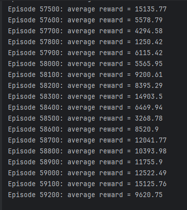
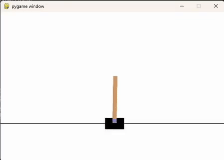

# TASK 5 - Pole balancing

Cílem úkolu bylo natrénovat za pomocí Q-Learningu agenta, který dosáhne skóre 200+ v pole balancing problému v prostředí Gymnasium. 

---
## Postup
- Prostředí gymnasium nám po každém kroku simulace vrátí vektor s aktuálním stavem. Tento vektor obsahuje:
  - Pozici vozíku
  - Rychlost vozíku
  - Úhel tyče
  - Úhlovou rychlost tyče
  
Tyto hodnoty jsou spojité, a proto bylo nutné je diskretizovat. Počet intervalů pro každou proměnnou je určen parametrem `n_bins`, který definuje granularitu.

- Akce je vybírána pomocí epsilon-greedy strategie:
  - S pravděpodobností epsilon je zvolena náhodná akce (explorace)
  - Jinak je zvolena nejlepší známá akce podle aktuální Q-matice

- Po provedení akce je získán nový stav, který je rovněž diskretizován.
- Q-matice je aktualizována podle Bellmanovy rovnice

Q-matice je aktualizována podle Bellmanovy rovnice, kde:
- `alpha` je learning rate
- `gamma` je diskontní faktor
- `epsilon` je míra explorace

---

## Výsledek
- Prostředí defaultně limituje maximální délku simulace na 500 kroků (max reward je 500), poté simulace končí.
- Ze zvědavosti jsem tento limit ignoroval. Chtěl jsem totiž vidět, jak dlouho agent vydrží tyč balancovat.
- Přiložený soubor obsahuje předtrénovaný Q-Matrix s granularitou 20 trénovaný na ~75 000 epizodách.
- Při trénování agent dosahoval dost vysokých odměn (i několik tisíc), což se pak způsobilo, že u výsledné vizualizace výsledku jsem ještě neviděl, že by agentovi tyč spadnula (většinou po mě to po 20 minutách přestalo bavit :D)

## Výstup

(Ukázka odměn dosažených při trénování)

(Testování agenta, [Imgur link na gif](https://imgur.com/a/30LT51L))
