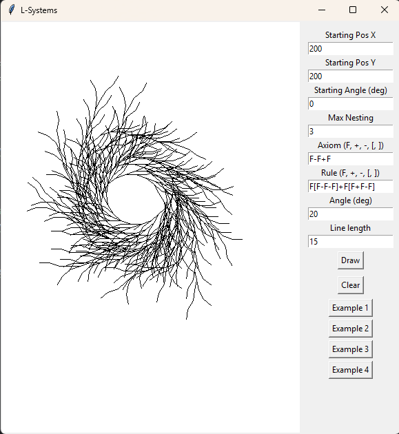
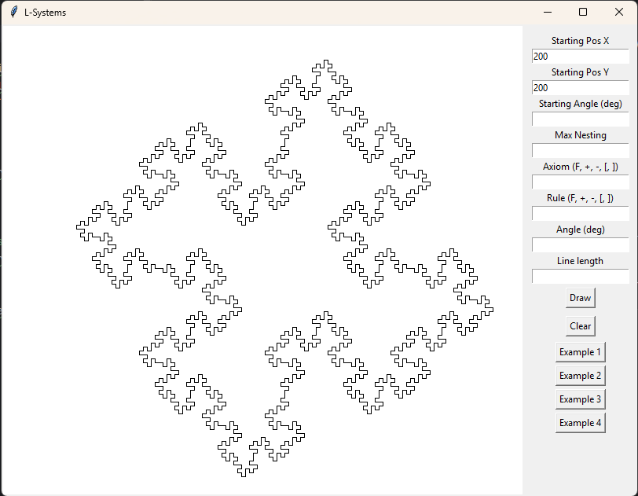

# TASK 6 - L-Systémy

Cílem úkolu bylo vytvořit aplikaci vizualizující Lindenmayerův systém.
Uživatel nastaví počáteční pozici, počáteční úhel, počáteční axiom, pravidlo, maximální hloubku zanoření, úhel (podle kterého se bude otáčet při použití `+` a `-`) a délku čáry (při použití `F`).
Uživatel může také využít 4 tlačítka, která aplikují do těchto proměnných vstup, který byl zadán jako ukázka v prezentaci.
---

### 1. Aplikace pravidla
- Úvodní axiom se předá do metody `apply_rule`, která nahradí výskyt znaku `F` pravidlem, které zadal uživatel.
- Tento postup se opakuje podle nastavené hloubky zanoření (`max_nesting`).

### 2. Vykreslení řetězce
- Řetězec se následně prochází znak po znaku a provádí se následující akce:
  - `F` – nakreslí se čára aktuální délkou a posune se pozice
  - `+` – otočení doprava o zadaný úhel
  - `-` – otočení doleva o zadaný úhel
  - `[` – uložení aktuální pozice a úhlu (pro větvení)
  - `]` – návrat na poslední uloženou pozici a úhel
  
---
## Výstup

(Uživatelem zadán vstup)

(Vykreslení jednoho z examplů)