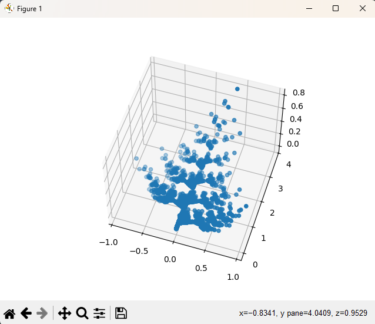
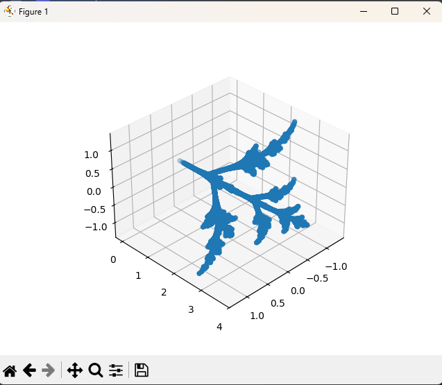

# TASK 7 - IFS

Cílem úkolu bylo vytvořit aplikaci pro generování 3D fraktálů pomocí IFS.

---

### 1. Generování fraktálu
- Fraktál se generuje pomocí opakování náhodných affiních transformací, které mění aktuální pozici bodu v prostoru.
- Hodnoty pro transformace jsou uživatelem předány na vstupu.
- Počet náhodných hodnot je dán uživatelem jako parametr vizualizační metody.
- V každém kroku se vybere náhodná transformace (náhodný řádek ze vstupní matice), která se následně provede.

### 2. Vykreslení fraktálu
- Body jsou vykresleny v 3D grafu.
  
---
## Výstup

(1. vstup ze zadání, 10000 iterací)

(2. vstup ze zadání, 10000 iterací)