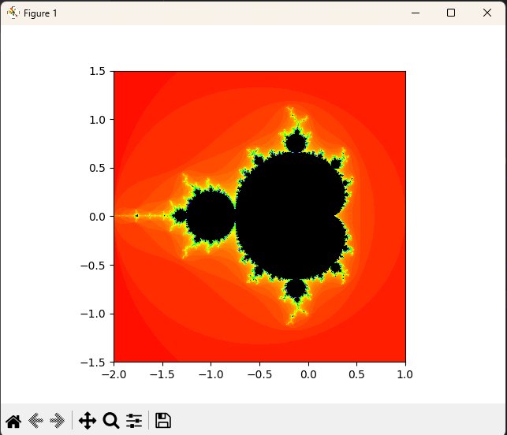
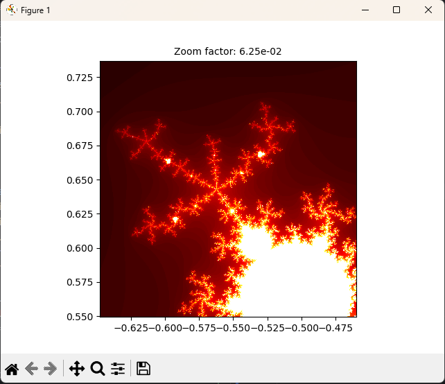

# TASK 8 - TEA

Cílem úkolu bylo vytvořit aplikaci pro vykreslení Mandelbrotovy, nebo Juliovy množiny s možností zoomu.
Implementace byla rozdělena do dvou skriptů. Použití aplikace a její fungování je popsáno níže.

---
## Skripty

### UI Skript
- Uživatel jako první spustí skript `main.py`, který vykreslí graf mandelbrotovy množiny.
- Po kliknutí do grafu se dané místo přiblíží a zvětší dvojnásobně.
- Uživatel si takto může přiblížit libovolné místo v grafu.
- Po zavření okna se do konzole vypíše příkaz s parametry, který uživatel může použít pro vygenerování animace zoomu.

### Generování animace
- Druhý skript `create_video.py` slouží k vytvoření animace zoomu.
- Defaultně generuje 10 vteřinové FHD video s 500 iteracemi na každý pixel.
- Pro zobrazení všech parametrů včetně jejich defaultních hodnot může uživatel použít příkaz
- `python create_video.py --help`
  
---

## Implementace
- Výpočet Mandelbrotovy množiny se nachází v pomocném skriptu `mandelbrot.py`.
- Samotný výpočet funguje tak, že se vezme hodnota každého pixelu, kde X-ová osa reprezentuje reálnou část a Y-ová osa imaginární část komplexního čísla.
- Poté počítáme _**zn + 1 = z2n + c**_, kde _**c**_ je naše komplexní číslo a _**n**_ je aktuální iterace.
- V každé iteraci kontrolujeme, zda hodnota _**z**_ zůstane omezená, nebo zda vyroste z námi sledované oblasti (ve skriptu kružnice s poloměrem 2)
- Pixel nakonec dostane hodnotu podle toho, v jaké iteraci hodnota opustila tuto oblast (nebo pokud ji neopustí, tak dostane hodnotu `max_iter`)
- Pro vizualizaci se tato hodnota používá defaultně jako hodota odstínu v HSV barevném modelu (hodnota `max_iter` je ale černá)
- Uživatel také ve skriptu generujícím video (i v GUI skriptu v proměnné `colormap_name`) specifikovat [hodnotu barevné palety matplotlibu](https://matplotlib.org/stable/users/explain/colors/colormaps.html).

---

## Optimalizace
- Protože výpočet Mandelbrotovy množiny je výpočetně náročná operace, tak byl výpočet optimalizován.
  - Pokud je k dispozici zařízení podporující technologii CUDA, tak je využito pro počítání pixelů každého snímku.
  - Pokud není, tak se jednotlivé snímky generují na separátních vláknech procesoru.
- _Poznámka: GUI skript využívá pouze CUDA optimalizace. Vlákno totiž generuje celý snímek, takže by to nedávalo smysl u statického grafu._

## Benchmark
- **FullHD video, 500 iterací na pixel**
  - _**CPU:**_ 28:52
  - **GPU:** 2:45
- **4K video, 500 iterací na pixel**
  - _**CPU:**_ 1:59:30
  - _**GPU:**_ 9:23

_**CPU:**_ Intel i7 14700F (8P + 12E cores, 28 threads)\
_**GPU:**_ NVIDIA GeForce RTX 4070 Ti SUPER (16G)

---

## Výstup

(Ukázka výchozího stavu UI skriptu, HSV)

(Ukázka zoomu v UI skruiptu, colormap "hot")

## Zoom animace
- Protože výsledné videa byly moc veliké a komprese/převod do GIFu by zničilo kvalitu, tak byly nahrány na YouTube.
- [4K, 1e-12 zoom, 500 iterací](https://www.youtube.com/watch?v=v2EWeeWx1t8)
- [4K, 1,78e-12 zoom, 500 iterací, hot colormap](https://youtu.be/v9k2pPL2Qq0)