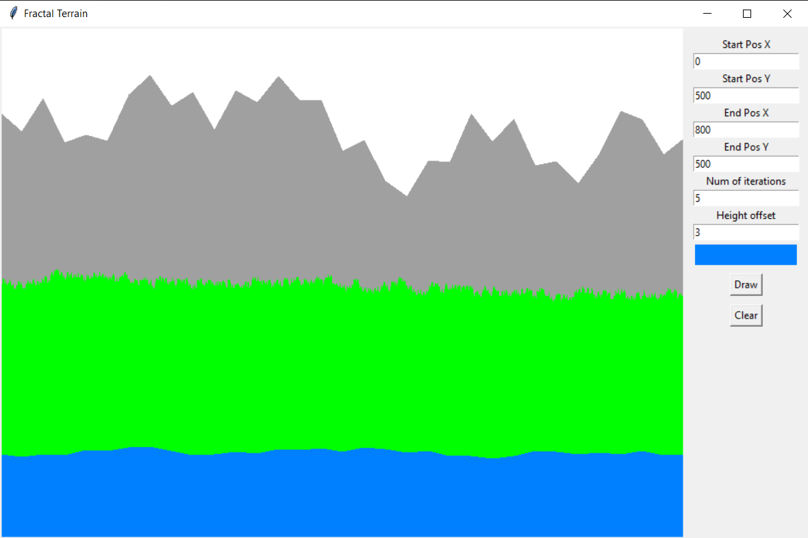

# TASK 9 - Generování terénu pomocí fraktálů

Cílem úkolu bylo vytvořit aplikaci pro generování povrchu pomocí fraktálů.

---

### 1. Generování fraktálu
- Začínáme usečkou od `start_pos` po `end_pos`
- Podle počtu iterací procházíme dvojice bodů usečky.
- Pro každou dvojici vypočítáme střed na horizontální a vertikální ose.
- Poté určíme s 50% šancí, že nový bod bude mít horizontální offset (`offset`) nad, nebo pod aktuálním středem.
- Nový bod je tak vložen mezi body aktuální dvojice.

### 2. Vykreslení fraktálu
- Pro první a poslední bod dopočítáme pravý a levý spodní bod polygonu.
- Následně vykreslíme polygon, čímž dostaneme náš terén.
  
---
## Výstup

(Ukázka výstupu programu)