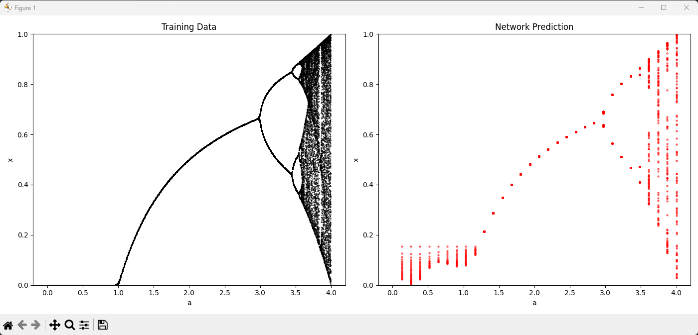
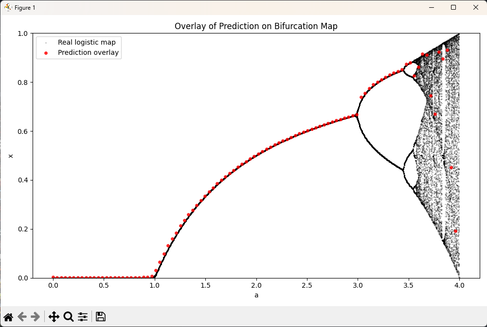

# TASK 10 - Teorie chaosu

Cílem úkolu bylo vizualizovat chaotické hodnoty v logistické mapě a pokusit se je predikovat.

---

## Logistická mapa

Funkce je definována jako:

xn+1 = a * xn * (1 - xn)

---

## Neuronová síť

K predikci hodnot logistické mapy byla použita neuronová síť. Struktura sítě je následující:
- **Vstupní vrstva**: Dvě hodnoty, které představují parametr _**a**_ a aktuální stav _**x**_
- **Dvě skryté vrstvy**: Každá obsahuje 64 neuronů s aktivací **ReLU**
- **Výstupní vrstva**: Jeden neuron, který vrací predikci hodnoty xn+1 pro daný _a_ a _xn_

Model byl trénován s využitím **stochastického gradientního sestupu (Adam)** a použití **střední čtvercové chyby (MSE)** jako ztrátové funkce.

---

## Postup

### 1. Generování trénovacích dat

- Vytvořena byla data pro trénink, která simulují hodnoty logistické mapy pro různé hodnoty _**a**_
- Pro každý parametr _**a**_ byl simulován určitý počet iterací, aby se vytvořil vzorec pro chování systému

### 2. Trénování modelu

- Na vytvořné množině dat byl následně natrénován model, který po 200 iteracích dosahoval ztráty = ~2e-06

### 3. Predikce

- Po dokončení trénování modelu bylo provedeno několik predikcí:
  - **Plná predikce bifurkačního diagramu**: Model byl použit k predikci celé trajektorie systému, kde byly hodnoty _**a**_ rozděleny do 32 kroků a pro každý z nich bylo predikováno 100 hodnot.
  - **Predikce jednoho průchodu**: Cílem bylo predikovat jednu trajektorii systému, což se ovšem nepodaří správně kvůli tomu, jak se systém chová. Predikované hodnoty se nedrží jedné větve, ale skáčou mezi nimi.

---

## Výstup

(Ukázka tréninkového datasetu použitého pro trénování vs predikce neuronové sítě - 32 steps)

(Ukázka predikce jednoho průchodu bifurkačním grafem - 100 steps)