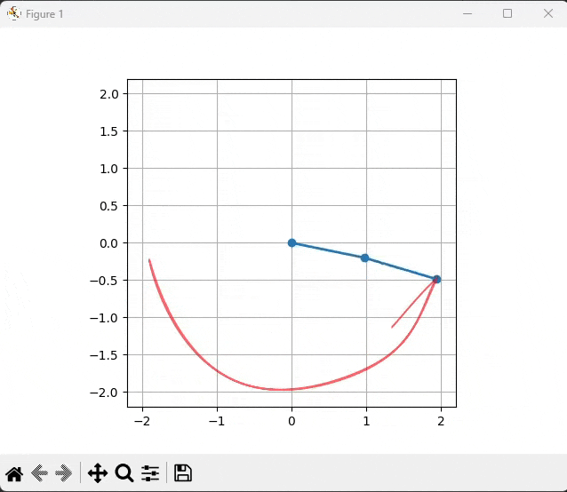

# TASK 11 - Double Pendulum

Cílem úkolu bylo vytvořit simulaci dvojitého kyvadla. 

---
## Postup
- Nastavíme úvodní úhly 𝜃1 a 𝜃2 na nějakou počáteční hodnotu.
- Úhlovou rychlost nastavíme na 0.
- Použijeme funkci `odeint` pro řešení diferenciálních rovnic.
  - Té předáme funkci `__get_derivative`, který vypočítá zrychlení kyvadel.
  - Dále aktuální stav ve tvaru [𝜃1', 𝜃1'', 𝜃2', 𝜃2''].
  - Parametr `t`, který značí pole časových kroků.
- Z výstupu funkce `odeint` získáme nové úhly 𝜃1 a 𝜃2.
- Z těchto úhlů můžeme pomocí metody `__calculate_cartesian_coordinates` vypočítat kartézské souřadnice kyvadla a vykreslit jako snímek v grafu..
---

## Výstup
- Při vytvoření instance třídy `DoublePendulum` můžeme nastavit délky ramen, váhy a počáteční úhly kyvadla.
- Po zavolání metody `run` se spustí simulace prostředí. Této metodě můžeme navíc specifikovat požadovaný framerate, délku animace a délku stopy, kterou kyvadlo zanechává.

(Výstup skriptu, [Imgur link na gif](https://imgur.com/a/fyclzfG))
